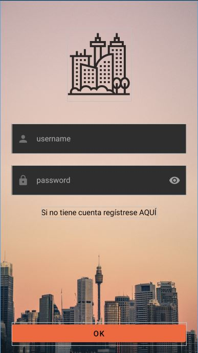
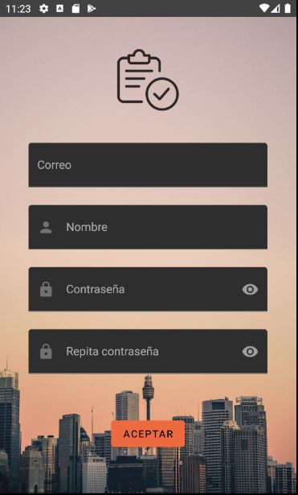
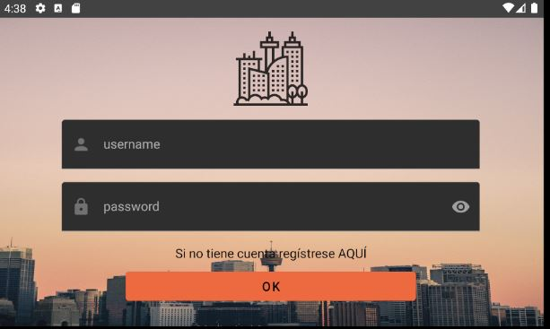
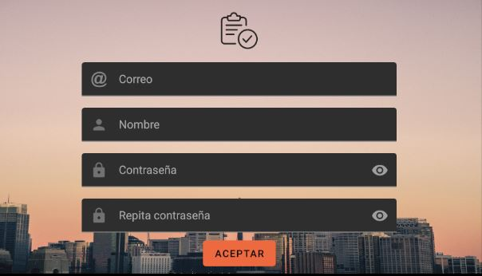
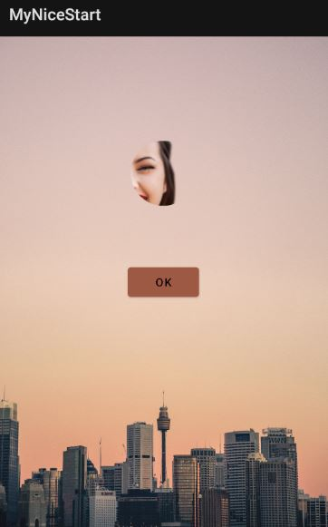
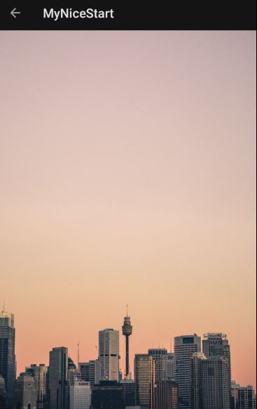

# NiceStart

**italic**

[Pablo López García en github](https://github.com/pablopez97)

-Splash

    -Ventana de inicio, en la que aparece el logo de la aplicación y el nombre con una suave animación.

-Login

    -En esta ventana aparecen dos campos apra que el usuario introduzca sus credenciales y entre a la apliación
    en el caso de que no tenga un perfil creado se le mandará a la ventana de registro
-Registro

    -En esta ventana el usuario puede crearse un perfil para poder usar la aplicación.

Splash | Login | Registro
-------|-------|---------
 |  |
LoginLand |------|RegsistroLand
|-----|
MainActivity|------|MainActivity2
|-----|
