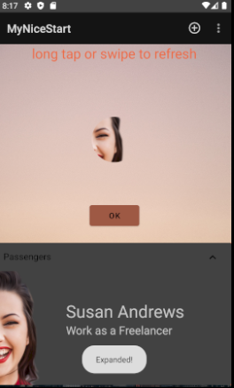
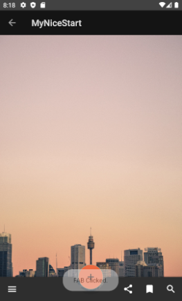

# NiceStart

**italic**

[Pablo López García en github](https://github.com/pablopez97)

-Splash

    -Ventana de inicio, en la que aparece el logo de la aplicación y el nombre con una suave animación.

-Login

    -En esta ventana aparecen dos campos apra que el usuario introduzca sus credenciales y entre a la apliación
    en el caso de que no tenga un perfil creado se le mandará a la ventana de registro
-Registro

    -En esta ventana el usuario puede crearse un perfil para poder usar la aplicación.
    
-MainActivity

    -En esta ventana encontraremos un botón de OK el cual al ser pulsado nos llevará a la ventana de
    MainActivity2, además encontraremos una animación de swipo to refresh, un menú en la parte superior
    de esta ventana y una expandable card que nos mostrará la información en este caso de un 
    usuario de nuestra aplicación.
 
 -MainActivity2
 
    -En esta ventana encontraremos un botón app bar con botones los cuales la única función que tendrán
    será mostrar unos toast con información acerca de estso. Además encontraremos una flecha en la esquina
    superior izquierda que al pulsarla nos llevará a la ventana anterior, la ventana de MainActivity.

Splash | Login | Registro
-------|-------|---------
 |  |
LoginLand |------|RegsistroLand
|-----|
MainActivity|------|MainActivity2
|-----|
